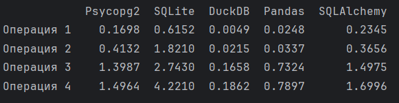

# Лабораторная работа №3

---
## 1. Сравнительные графики

### Таблица с результатами запросов

---
### Столбчатая диаграмма сравнения времени выполнения четырех операций по библиотекам

---
### Линейный график изменения времени выполнения четырех операций по библиотекам

---
## 2. “Впечатления” от каждой библиотеки

### Psycopg2
Psycopg2 - мощная библиотека для работы с PostgreSQL в Python, но её использование может быть сложным из-за необходимости выполнения дополнительных шагов для настройки соединения с базой данных. Несмотря на обилие функционала, который предоставляет доступ к различным возможностям PostgreSQL, такие как транзакции и обработка данных, это может вызвать замедление выполнения запросов. Сравнительно с другими библиотеками, Psycopg2 демонстрирует средние результаты по скорости выполнения, что, возможно, связано с особенностями API и системой транзакций, требующей подтверждения каждой операции, что замедляет процесс.

### SQLite
SQLite представляет собой компактную и легкую в использовании базу данных, не требующую отдельной установки сервера. Однако, её скорость выполнения запросов может быть ниже по сравнению с другими системами из-за определенных особенностей, по сравнению с другими она выполняется в разы дольше. Например, запись журнала на диск по умолчанию может привести к более длительному времени выполнения операций. Кроме того, ограниченная оптимизация операций в памяти может сказываться на производительности, особенно при работе с большими объемами данных.

### DuckDB
DuckDB - относительно новая библиотека, которая имеет высокую скорость выполнения запросов, особенно в аналитических задачах и при работе с большими объемами данных. Она оптимизирована для аналитических запросов, что обуславливает её высокую производительность. Однако, следует отметить, что у неё есть свои ограничения: она может не поддерживать определенные функции, которые могут быть полезны для более сложных или специализированных задач. Также, в силу своей новизны, некоторые возможности могут быть еще не полностью разработаны и протестированы, что может повлиять на её стабильность и надежность.

### Pandas
Pandas - мощная и гибкая библиотека для работы с данными, предоставляющая обширный набор функций для обработки и анализа данных. Однако, на больших объемах данных Pandas может показывать не такую высокую производительность, как остальные библиотеки. Её сложность использования для новичков может стать препятствием для быстрого освоения, но её функциональность и возможности комбинирования с другими библиотеками делают её ценным инструментом для работы с данными.

### SQLAlchemy
SQLAlchemy, подобно Psycopg2, предоставляет обширные возможности для взаимодействия с PostgreSQL. Она обладает многофункциональностью, что может стать преимуществом при работе с более сложными задачами, но может вызывать слабые результаты по скорости выполнения запросов в случае, когда требуется минимум функционала для выполнения конкретной задачи. Несмотря на свои преимущества, из-за обширности функционала и широкого спектра возможностей, время выполнения запросов может оказаться ниже по сравнению с более оптимизированными библиотеками.

## 3. Сравнение библиотек 

---
### Производительность:
#### Psycopg2: 
Обладает средней производительностью из-за системы транзакций, требующей подтверждения каждой операции.
#### SQLite: 
Скорость выполнения запросов может быть снижена из-за ограниченной оптимизации операций в памяти и записи на диск.
#### DuckDB: 
Известен своей высокой производительностью в аналитических задачах и с большими объемами данных.
#### Pandas: 
На больших объемах данных производительность может быть несколько ниже по сравнению с оптимизированными СУБД.
#### SQLAlchemy: 
В зависимости от использования может быть менее эффективной из-за обширности функционала.

--- 
### Удобство использования:

#### Psycopg2: 
Требует настройки соединения, что может быть сложным для новичков.
#### SQLite: 
Прост в использовании и не требует настройки сервера.
#### DuckDB: 
Обычно предоставляет хороший баланс между производительностью и удобством.
#### Pandas: 
Предоставляет удобный интерфейс для работы с данными, но может быть сложным на больших объемах данных.
#### SQLAlchemy: 
Позволяет использовать ORM для удобства взаимодействия с базой данных.

---
### Поддержка функционала:
#### Psycopg2: 
Широкие возможности для взаимодействия с PostgreSQL.
#### SQLite: 
Меньше функциональность по сравнению с другими СУБД.
#### DuckDB:
Оптимизирован для аналитических задач, но может иметь ограничения в поддержке функций.
#### Pandas:
Обширный набор функций для работы с данными.
#### SQLAlchemy:
Многофункциональность и возможность работы с различными СУБД.

---
### Сложность настройки:

#### Psycopg2: 
Требует дополнительных шагов для настройки соединения.
#### SQLite:
Не требует особых настроек или установки сервера.
#### DuckDB:
Обычно не требует сложной настройки.
#### Pandas:
Легок в освоении, но может быть сложным на больших объемах данных.
#### SQLAlchemy:
Требует определенного времени для изучения и использования его полного функционала.

--- 
### Вывод
Эти библиотеки имеют свои особенности и предназначены для различных сценариев использования. Выбор оптимальной библиотеки зависит от требований к производительности, сложности задачи и уровня удобства в использовании, поэтому важно выбирать их с учетом специфики проекта или задачи.